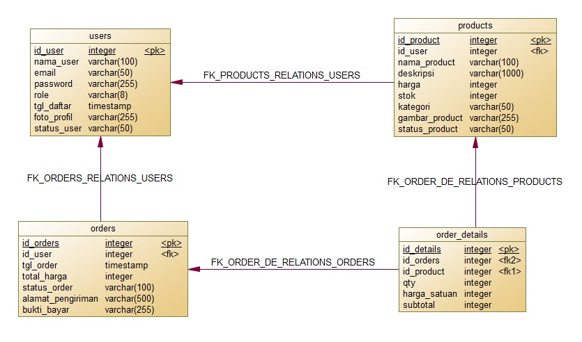

# Marketplace Website

A full-stack marketplace web app with two roles, **pembeli** (buyer) and **penjual** (seller): browse products, cart, checkout with manual payment proof, and seller-side order validation.

## Features

**Buyer (`pembeli`)**
- Register / login (JWT)
- Browse product catalog, view product detail
- Cart (add, update qty, remove) — client-side only
- Checkout with shipping address → creates order
- Upload payment proof (image)
- View order history and order detail/status

**Seller (`penjual`)**
- Register / login (JWT)
- CRUD own products, with image upload
- View incoming orders for own products
- Accept / reject an order, update its status

## Tech Stack

| Layer    | Stack |
|----------|-------|
| Frontend | React 19, React Router 7, Zustand, Axios, react-hot-toast, Vite |
| Backend  | Node.js, Express 5, JWT (`jsonwebtoken`), `bcrypt`, `multer` |
| Database | PostgreSQL (Neon) via Drizzle ORM |
| Storage  | Supabase Storage (profile photos, product images, payment proofs) |

## Architecture

```
Frontend (React)  --HTTP/REST-->  Express Backend
                                       │
                          Route → Middleware → Controller → Service
                                       │
                              ┌────────┴────────┐
                        Drizzle ORM         Supabase Storage
                              │
                        Neon PostgreSQL
```

- **Routes** — define endpoints, wire up middleware/controllers.
- **Middleware** — JWT auth (`authMiddleware`), role check (`requireRole`), file upload (`uploadMiddleware`/multer).
- **Controllers** — handle req/res.
- **Services** — business logic, DB access, Supabase Storage calls.

## Project Structure

```
backend/
  src/
    config/supabase.js        Supabase client
    controllers/              userController, productController, orderController
    db/
      index.js                Drizzle + Neon connection
      schema.js                users, products, orders, order_detail
    middleware/                authMiddleware.js, uploadMiddleware.js
    routes/                    userRoutes, productRoutes, orderRoutes
    services/                  userService, productService, orderService, storageService
    server.js
  drizzle/                     generated SQL migrations
frontend/
  src/
    pages/                    Catalog, ProductDetail, Cart, Checkout, Login, Register,
                               orders/ (MyOrders, OrderDetail), seller/ (SellerProducts, SellerOrders)
    routes/                   AppRoutes, ProtectedRoute, PublicRoute
    components/, services/, stores/, utils/
```

## Database Schema

- **users** — `id_user`, `nama_user`, `email` (unique), `password` (bcrypt hash), `role` (`pembeli`/`penjual`), `foto_profil`, `status_user` (`aktif`/`tidak_aktif`)
- **products** — `id_product`, `id_penjual` → users, `nama_product`, `deskripsi`, `harga`, `stok`, `kategori`, `gambar_product`, `status_product` (`tersedia`/`habis`)
- **orders** — `id_order`, `id_pembeli` → users, `total_harga`, `alamat_pengiriman`, `bukti_bayar`, `status_order`
- **order_detail** — `id_detail`, `id_order` → orders, `id_product` → products, `qty`, `harga_satuan`, `subtotal`

Order status lifecycle (`status_order` enum):

```
menunggu_bayar → menunggu_konfirmasi → diproses → dikirim → selesai
                        └──────────────→ dibatalkan
```

### Physical Data Model



4 tabel: `users` (1) —< `products` (1) —< `order_detail` >— (1) `orders` >— (1) `users`. `orders` dan `products` sama-sama mereferensikan `users` (sebagai `id_pembeli` dan `id_penjual`), sedangkan `order_detail` menjadi tabel penghubung many-to-many antara `orders` dan `products`.

Schema source of truth: [backend/src/db/schema.js](backend/src/db/schema.js).

## API Reference

Base URL: `http://localhost:5000/api/v1`

**Users** (`/users`)
| Method | Path | Auth | Description |
|---|---|---|---|
| POST | `/` | – | Register |
| POST | `/login` | – | Login → `{ token, user }` |
| GET | `/profile` | JWT | Get own profile |
| PUT | `/profile` | JWT | Update profile (`foto_profil` multipart field) |

**Products** (`/products`)
| Method | Path | Auth | Description |
|---|---|---|---|
| GET | `/` | – | List products |
| GET | `/:id` | – | Product detail |
| POST | `/` | JWT + `penjual` | Create product (`gambar_product` multipart field) |
| PUT | `/:id` | JWT + `penjual` | Update product |
| DELETE | `/:id` | JWT + `penjual` | Delete product |

**Orders** (`/orders`)
| Method | Path | Auth | Description |
|---|---|---|---|
| POST | `/` | JWT + `pembeli` | Create order |
| GET | `/my-orders` | JWT + `pembeli` | Buyer's own orders |
| POST | `/:id/payment-proof` | JWT + `pembeli` | Upload proof (`bukti_bayar` multipart field) |
| GET | `/:id` | JWT | Order detail (buyer or seller involved) |
| GET | `/seller/orders` | JWT + `penjual` | Orders for seller's products |
| PATCH | `/seller/:id/accept` | JWT + `penjual` | Accept order |
| PATCH | `/seller/:id/reject` | JWT + `penjual` | Reject order |
| PATCH | `/seller/:id/status` | JWT + `penjual` | Update order status |

Route source of truth: [backend/src/routes/](backend/src/routes/).

## Authentication & Authorization

- JWT issued on login, sent as `Authorization: Bearer <token>`.
- `authMiddleware` verifies the token; `requireRole("pembeli" | "penjual")` restricts by role.
- Passwords hashed with `bcrypt`, never stored in plain text.
- Authorization is enforced on the backend only — frontend route guards (`ProtectedRoute`) are UX convenience, not security.

## Storage

All Supabase Storage access happens server-side (service-role key never reaches the frontend).

| Bucket | Used for |
|---|---|
| `profile-images` | User profile photos |
| `product-images` | Product images |
| `payment-proofs` | Payment proof uploads |

## Environment Variables

`backend/.env`:

```env
PORT=5000
DATABASE_URL=your_neon_database_url

JWT_SECRET=your_jwt_secret

SUPABASE_URL=your_supabase_url
SUPABASE_SERVICE_ROLE_KEY=your_supabase_service_role_key
```

Never commit `.env`. `DATABASE_URL`, `JWT_SECRET`, and `SUPABASE_SERVICE_ROLE_KEY` must never be exposed to the frontend.

## Getting Started

```bash
git clone <repository-url>
cd lsd-project

# Backend
cd backend
npm install
# create backend/.env with the variables above
npm run dev            # http://localhost:5000

# Frontend (new terminal)
cd frontend
npm install
npm run dev             # URL printed in terminal
```

Database migrations (Drizzle) live in `backend/drizzle/`; run them against `DATABASE_URL` via `drizzle-kit` as needed.

## License

Developed for educational/project purposes.
